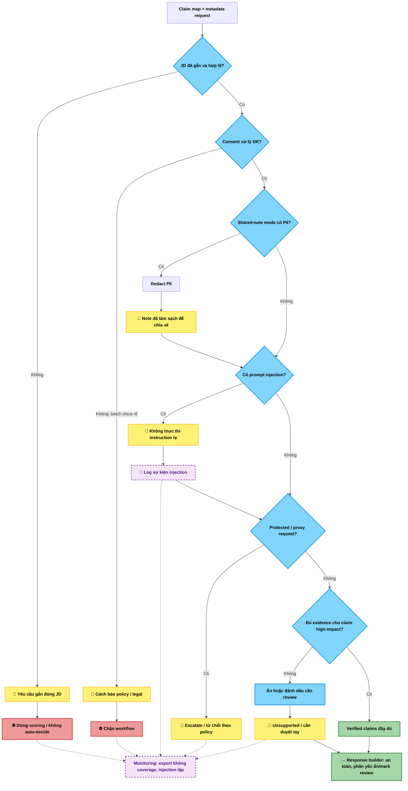
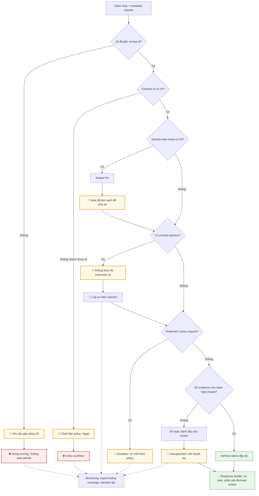
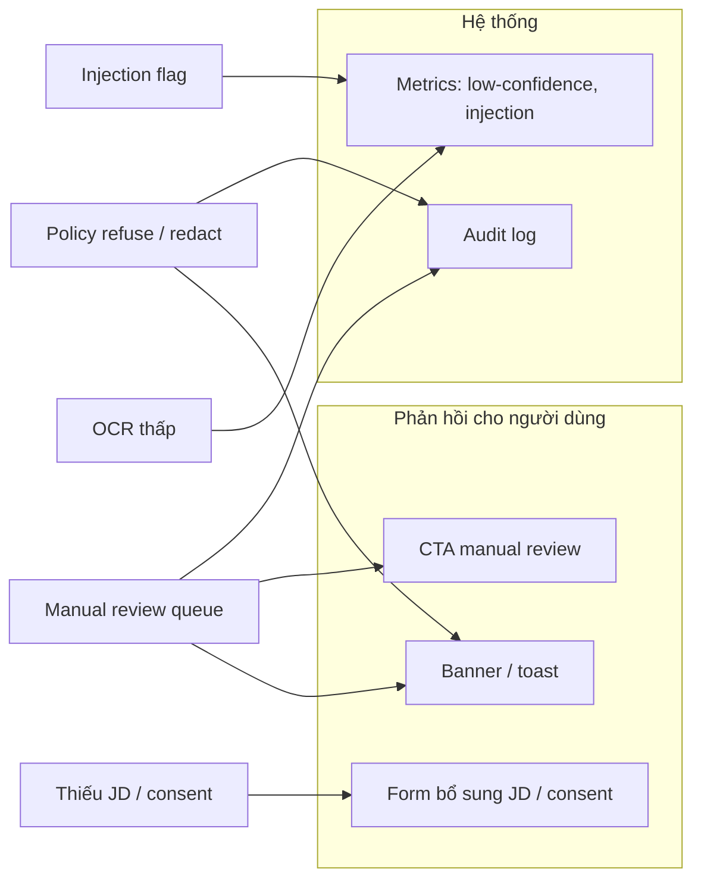

# demo.md — Demo kiến trúc dữ liệu

## 1. Sơ đồ cách hệ thống xử lý (Mermaid)

### 1.1 Luồng tổng thể: ingest → gate → evidence → policy → UI

Luồng đọc từ trên xuống; nhánh **fallback** dừng hoặc chuyển sang người; **thông báo** gắn với UI/audit.

### 1.2 Policy engine: kiểm tra tuần tự, chặn / redact / escalate

Thứ tự phản ánh “dừng sớm khi thiếu điều kiện bắt buộc”, sau đó mới xử lý nội dung rủi ro và độ bao phủ evidence.

### 1.3 Gom nhánh lỗi → người dùng + hệ thống

---

## 2. Thành phần chính

| Thành phần | Nhận gì? | Làm gì? | Trả ra gì? |
|---|---|---|---|
| OCR / parser | PDF, DOCX, ảnh CV | Trích text, section, metadata | Structured text + parser warnings |
| Quality gate | Structured text | Tính confidence đọc được, phát hiện file không phải CV | Confidence + allow/manual-review |
| Evidence extractor | CV text + JD | Tạo claim + span hỗ trợ | Claim map |
| Policy engine | Claim map + user request | Chặn consent/PII/injection/proxy violations | Allow / refuse / redact / escalate |
| Response builder | Claim map đã qua rule | Tạo summary an toàn | Output cho UI |
| Monitoring log | Query + gate outcome | Theo dõi pattern lỗi lặp lại | Dashboard / audit |

## 3. Khi hệ thống gặp vấn đề

| Khi nào lỗi xảy ra? | Hệ thống làm gì? | Người dùng thấy gì? |
|---|---|---|
| OCR/parser confidence thấp | Không cho auto-decide | Banner low-confidence + Manual review |
| Thiếu JD hoặc JD sai | Dừng scoring | Yêu cầu gắn đúng JD |
| Yêu cầu import batch chưa rõ consent | Chặn workflow | Cảnh báo policy/legal |
| CV chứa instruction lạ | Flag injection | Không làm theo text đó, log sự kiện |
| Shared mode có PII | Redact | Note sạch để chia sẻ nội bộ |

## 4. Kiểm tra nhanh

- [x] Có gate cụ thể, không chỉ “AI trả lời tốt hơn”.
- [x] Có cách xử lý khi thiếu dữ liệu.
- [x] Có manual-review path.
- [x] Có monitoring để lần sau sửa tốt hơn.
